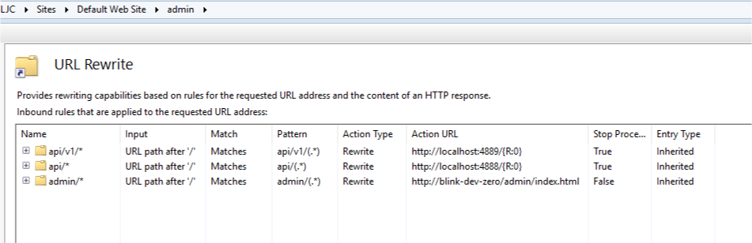
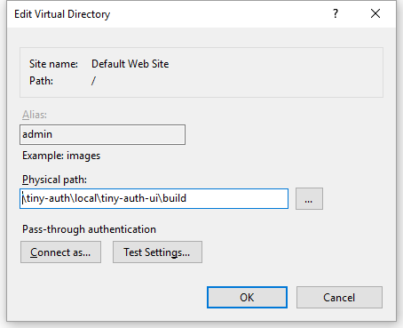

IIS:



web.config:  

```xml
<?xml version="1.0" encoding="UTF-8"?>
<configuration>
    <system.webServer>
        <rewrite>
            <rules>
                <clear />
                <rule name="api/v1/*" stopProcessing="true">
                    <match url="api/v1/(.*)" />
                    <conditions logicalGrouping="MatchAll" trackAllCaptures="false" />
                    <action type="Rewrite" url="http://localhost:4889/{R:0}" />
                </rule>
                <rule name="api/*" enabled="true" stopProcessing="true">
                    <match url="api/(.*)" />
                    <conditions logicalGrouping="MatchAll" trackAllCaptures="false" />
                    <action type="Rewrite" url="http://localhost:4888/{R:0}" logRewrittenUrl="true" />
                </rule>
                <rule name="admin/*">
                    <match url="admin/(.*)" />
                    <conditions>
                        <add input="{REQUEST_FILENAME}" matchType="IsFile" negate="true" />
                    </conditions>
                    <action type="Rewrite" url="http://blink-dev-zero/admin/index.html" />
                </rule>
            </rules>
        </rewrite>
    </system.webServer>
</configuration>
```

Site:

